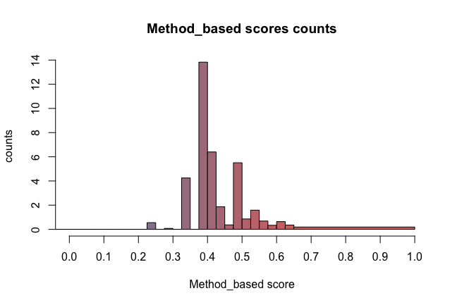
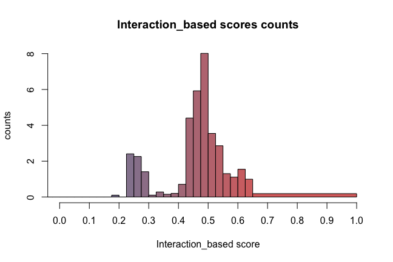

# `BCB420.2019.hitPredict`
# inspired by Boris Steip https://github.com/hyginn/BCB420.2019.STRING
#### (hitPredict data annotation of human genes)

&nbsp;

###### Han Zhang, University of Toronto, Canada. &lt;helenzhang0814@outlook.com&gt;
----

##1 About this package:

This package describes the workflow of download the hitPredict data on human genes from the [hitPredict database](http://hintdb.hgc.jp/htp/index.html), how to map HGNC symbols to hitProdict domains, how to annotate the example gene set and provides examples database statistics.


&nbsp;

#### In this project ...

```text
 --BCB420.2019.hitPredict/
   |__.tests/
       |__testthat.R
       |__testthat/
          |__test_lseq.R
          |__helper-functions.R
   |__README.md                    # this file 
   |__R/
      |__zzz.R
   |__NAMESPACE  
   |__LICENSE
   |__inst/
      |__scripts/
         |__scriptTemplate.R      
      |__Image/
         |__[...]                  # image sources for .png document
      |__extdata/
         |__xSetScore.tsv          # result file from annotation
         |__test_lseq.dat
         |__enstsym.RData          # ENSP ID to HGNC symbol mapping tool
   
   |__Hitp.Rproj
   |__DESCRIPTION
   |__Rhistory
   |__.Rbuildignore
   |__.gitignore

```

&nbsp;

----

## 2 hitPredict Data
#information is from http://hintdb.hgc.jp/htp/download.html
Protein-protein interactions from IntAct, BioGRID, HPRD, MINT and DIP are combined, annotated and scored. The reliability score is calculated based on the experimental details of each interaction and the sequence, structure and functional annotations of the interacting proteins.


&nbsp;


#### 2.1 Data semantics

# this information is taken from the website http://hintdb.hgc.jp/htp/download.html
HitPredict is a resource of experimentally identified physical protein-protein interactions. It was compiled in the following manner:

All physical interactions were downloaded from IntAct, BioGRID, HPRD, DIP and MINT. These were combined to form a non-redundant dataset. Species with less than 10 interactions were removed.

All non-physical interactions, such as genetic interactions, were excluded.

Interactions of proteins from different species were also excluded.

All proteins were assigned valid UniProt IDs. In cases where UniProt IDs could not be directly assigned, protein sequences were aligned to UniProtKB using BLAST and the ID of the longest hit with 99% sequence identity was used.

Interactions in which one or both of the proteins were no longer present in UniProt, were removed.

Interactions of proteins that did not map to valid UniProt IDs were removed. Interactions were excluded only after manual confirmation.

The interacting proteins were annotated with Entrez gene IDs, Ensembl IDs, Pfam domains and Gene Ontology terms.

&nbsp;

## 3 Data download and cleanup

To download the source data from hitPredict ... :

1.  Navigate to [**hitPredict**](http://hintdb.hgc.jp/htp/index.html)
2.  Click on the download link at the top, which will direct you to the download page
3.  Download H_sapiens_interactions.txt.tgz and save it in sister directory data
4.  Uncompress the file and place it in your sister directory of your current directory, it can      be reachable with file.path("..", "data")

* `H_sapiens_interactions.txt` (68.1 MB) ;

&nbsp;

## 4 Mapping HGNC symbols to hitPredict domain IDs

#### Preparations: packages, functions, files

To begin, we need to make sure the required packages are installed:

**`readr`** provides functions to read data which are particularly suitable for
large datasets. They are much faster than the built-in read.csv() etc. But caution: these functions return "tibbles", not data frames. ([Know the difference](https://cran.r-project.org/web/packages/tibble/vignettes/tibble.html).)
```R
if (! requireNamespace("readr")) {
  install.packages("readr")
}
```

&nbsp;

**`biomaRt`** biomaRt is a Bioconductor package that implements the RESTful API of biomart,
the annotation framwork for model organism genomes at the EBI. It is a Bioconductor package, and as such it needs to be loaded via the **`BiocManager`**,
&nbsp;

```R
if (! requireNamespace("BiocManager", quietly = TRUE)) {
  install.packages("BiocManager")
}
if (! requireNamespace("biomaRt", quietly = TRUE)) {
  BiocManager::install("biomaRt")
}
```

&nbsp;

**`dplyr`** is a convenient package to transform and summarize tabular data with rows and columns. It contains a set of functions that perform common data manipulation operations such as filtering roles, re-ordering rows and summarizing data.;

```R
if (! requireNamespace("igraph")) {
  install.packages("igraph")
}
```

&nbsp;

#### 4.1 Step 1: Which symbols do we have to map ?

&nbsp;

```R
# Load HitPredict data with start and end coordinates
data <- as.data.frame(readr::read_delim(file.path("../data", "H_sapiens_interactions.txt"),
                          delim = "\t",
                          skip = 1,
                          col_names = c("uniprot1", "uniprot2", "a",
                                        "b", "Entrez1", "Entrez2", "Ensembl1", "Ensembl2", 
                                        "Taxonomy", "type", "source", "method_s", 
                                        "annotation_s", "interaction_s", "confidence")))
                      
  head(data)
#  uniprot1 uniprot2           a           b Entrez1 Entrez2
#1   Q00987   P04637  MDM2_HUMAN   P53_HUMAN    4193    7157
#2   Q16665   P40337 HIF1A_HUMAN   VHL_HUMAN    3091    7428
#3   P04637   Q09472   P53_HUMAN EP300_HUMAN    7157    2033
#4   Q9Y6K9   O14920  NEMO_HUMAN  IKKB_HUMAN    8517    3551
#5   Q5S007   Q5S007 LRRK2_HUMAN LRRK2_HUMAN  120892  120892
#6   P49427   P62877 UB2R1_HUMAN  RBX1_HUMAN     997    9978                                                        
#   Ensembl1
#1  ENST00000258149 [Q00987-11],ENST00000299252 [Q00987-5],ENST00000360430 #[Q00987-2],ENST00000393413 [Q00987-4]
#2  ENST00000323441 [Q16665-2],ENST00000337138 [Q16665-1],ENST00000539097 [Q16665-3]
#3  ENST00000269305 [P04637-1],ENST00000420246 [P04637-2],ENST00000445888 #[P04637-1],ENST00000455263 [P04637-3],ENST00000504290 [P04637-9],ENST00000504937 #[P04637-7],ENST00000510385 [P04637-8],ENST00000610292 [P04637-4],ENST00000610538 #[P04637-6],ENST00000617185 [P04637-2],ENST00000619485 [P04637-4],ENST00000620739 #[P04637-4],ENST00000622645 [P04637-5]
#4  ENST00000594239 [Q9Y6K9-1],ENST00000611071 [Q9Y6K9-1],ENST00000611176 [Q9Y6K9-3],ENST00000618670 [Q9Y6K9-2]
#5  ENST00000298910
#6  ENST00000215574


#   Ensembl2
#1  ENST00000269305 [P04637-1],ENST00000420246 [P04637-2],ENST00000445888 [P04637-1],ENST00000455263 [P04637-3],ENST00000504290 [P04637-9],ENST00000504937 [P04637-7],ENST00000510385 [P04637-8],ENST00000610292 [P04637-4],ENST00000610538 [P04637-6],ENST00000617185 [P04637-2],ENST00000619485 [P04637-4],ENST00000620739 [P04637-4],ENST00000622645 [P04637-5]
#2  ENST00000256474 [P40337-1],ENST00000345392 [P40337-2]
#3  ENST00000263253
#4  ENST00000416505 [O14920-4],ENST00000519735 [O14920-3],ENST00000520810 [O14920-1],ENST00000520835 [O14920-2]
#5  ENST00000298910
#6  ENST00000216225    

#    Taxonomy        type source method_s annotation_s interaction_s confidence
#1     9606 Small-scale intact  0.99925            1     0.9996249       High
#2     9606 Small-scale intact  0.99577            1     0.9978828       High
#3     9606 Small-scale intact  0.99555            1     0.9977725       High
#4     9606 Small-scale intact  0.99510            1     0.9975470       High
#5     9606 Small-scale intact  0.99506            1     0.9975269       High
#6     9606 Small-scale intact  0.99383            1     0.9969102       High
```

```R
 #remove the square bracket after some ensembl id
data$Ensembl1 <- gsub(" \\[.*", "", data$Ensembl1)
data$Ensembl1 <- gsub("\\,.*", "", data$Ensembl1)
data$Ensembl2 <- gsub(" \\[.*", "", data$Ensembl2)
data$Ensembl2 <- gsub("\\,.*", "", data$Ensembl2)
```
Next, check how many IDs we need to map

```R
uENST <- unique(c(data$Ensembl1, data$Ensembl2))
#260271 objects need to be mapped
```
&nbsp;

#### 4.2 Step 2: mapping via biomaRt 
We use biomaRt to fetch HGNC symbols and for the remaining that we didn't 

```R
# map ENST to HGNC
myMart <- biomaRt::useMart("ensembl", dataset="hsapiens_gene_ensembl")
result <- biomaRt::getBM(filters = "ensembl_transcript_id",
                attributes = c("ensembl_transcript_id",
                               "hgnc_symbol"),
                               values = uENST,
                               mart = myMart)
                               
 head(result)
#ensembl_transcript_id hgnc_symbol
#1       ENST00000375320       APOA1
#2       ENST00000356219       NCOR2
#3       ENST00000292599       MAML1
#4       ENST00000221930       TGFB1
#5       ENST00000536769       UBC
#6       ENST00000262887       XRCC1

```

&nbsp;

#### 4.21: remove duplicate
There are some ensembl ID are the same, need to remove the duplicates

```R
remove duplicate
sel <- unique(result[, c("hgnc_symbol", "ensembl_transcript_id")])
dupEnst <- sel$ensembl_transcript_id[duplicated(sel$ensembl_transcript_id)]
sel[sel$ensembl_transcript_id %in% dupEnst, ]

          hgnc_symbol ensembl_transcript_id
#1058      CCL3L3       ENST00000619989
#1059      CCL3L1       ENST00000619989
#1091      CCL3L3       ENST00000612067
#1092      CCL3L1       ENST00000612067
#1094      CCL3L3       ENST00000615140
#1095      CCL3L1       ENST00000615140
#1149      CCL3L3       ENST00000621940
#1150      CCL3L1       ENST00000621940
#796       HLA-A        ENST00000457879
#3261      HLA-A        ENST00000457879

#remove the target rows
result <- result[ ! (result$hgnc_symbol %in% c("CCL3L3", "CCL3L1", "HLA-A")), ]
#check if there are still dupicates exist now
any(duplicated(result$ensembl_transcript_id))
#[1] FALSE
```
&nbsp;

After cleaning up the duplicates, define the tool of mapping

```R
enstsym <- result$hgnc_symbol
names(enstsym) <- result$ensembl_transcript_id
head(enstsym)
#ENST00000375320 ENST00000359492 ENST00000375323 
#        "APOA1"         "APOA1"         "APOA1"     
#ENST00000236850 ENST00000536769 ENST00000339647
#        "APOA1"           "UBC"           "UBC" 
```
&nbsp;

#### 4.22: validation of enstsym
There are still IDs that we couldn't find from biomaRt fetching 
Add those symbols to the map

```R
sel <- ! (uENST %in% names(enstsym))
c <- rep(NA, sum( sel))
names(c) <- uENST[ sel ]

#check the uniqueness
any(duplicated(c(names(c), names(enstsym))))
#[1] FALSE
#concatenation
enstsym <- c(enstsym, c)
#confirm
all(uENST %in% names(enstsym))
#[1] TRUE
```
Set the symbols that returned an empty string to NA:

```R
sel <- which(enstsym == "") 
enstsym[head(sel)] #before
enstsym[sel] NA
enstsym[head(sel)] #after

#check if we have all the ENST IDs accounted for
all( uENST %in% names(enstsym))
#[1] TRUE

```
&nbsp;

#### 4.3 Step Three: outdated symbols

Now we have unique IDs for each ENST in the mapping table, are they all correct symbols? Maybe some of the symbols are outdated and we need to fix that.

```R

#check if all the symbols present in the reference table
sel <- ( ! (enstsym %in% HGNC$sym)) & ( ! (is.na(enstsym)))
#unknown id
length(        enstsym[ sel ] )
[1] 69
#check the number of unique
length( unique(enstsym[ sel ]))
[1] 69

#put the symbols in a dataframe
newSym <- data.frame(unk = enstsym[ sel ],
                       new = NA,
                       stringsAsFactors = FALSE)

#grep() for the presence of the symbols either HGNC$prev or HGNC$synonym,
#if either is found, it replaces NA
for (i in seq_len(nrow(newSym))) {
    previous <- grep(newSym$unk[i], HGNC$prev)[1] 
    if (length(previous) == 1) {
      newSym$new[i] <- HGNC$sym[previous]
    } else {
      synonym <- which(grep(newSym$unk[i], HGNC$synonym))[1]
      if (length(synonym) == 1) {
        newSym$new[i] <- HGNC$sym[synonym]
      }
    }
  }

#check the number we found
sum(! is.na(newSym$new))
#[1] 49

#add the newSym$new to enstsym
enstsym[rownames(newSym)] <- newSym$new

```

#### 4.4: Final validation

```R

# do we have all IDs mapped
all(uENST %in% names(enstsym)) 
[1] TRUE

#how many symbols we found
sum(! is.na(enstsym)) 
#[1] 11957

#in%
> sum(! is.na(enstsym)) * 100 / length(enstsym)
[1] 50.94589

#check that all symbols are in the reference table
> all(enstsym[! is.na(enstsym)] %in% HGNC$sym)
[1] TRUE


#save
save(enstsym, file = file.path("inst", "extdata", "enstsym.RData"))

```

## 5. Annotating gene sets with HitPredict Data

We can now annotate the gene sets using the datasets.
Load the graph that shows the distribution of method_score in the human gene dataset.

``` R
minScore <- 0
maxScore <- 1
hist(data$method_s[(data$method_s >= minScore) & (data$method_s <= maxScore)],
      xlim = c(minScore, maxScore),
      breaks = c((seq(minScore, (maxScore - 0.25), by = 0.025) - 0.1), maxScore),
      main = "Method_based scores counts",
      col = colorRampPalette(c("#FFFFFF","#8888A6","#FF6655"), bias = 2)(40),
      xlab = "Method_based score",
      ylab = "counts",
      xaxt = "n")
axis(1, at = seq(minScore, maxScore, by = 0.1))
abline(v = 900, lwd = 0.5)
```



&nbsp;

Now let us take a look at the distribution graph for the interaction score.

```R
minScore <- 0
maxScore <- 1
hist(data$interaction_s[(data$interaction_s >= minScore) & (data$interaction_s <= maxScore)],
     xlim = c(minScore, maxScore),
     breaks = c((seq(minScore, (maxScore - 0.25), by = 0.025) - 0.1), maxScore),
     main = "Interaction_based scores counts",
     col = colorRampPalette(c("#FFFFFF","#8888A6","#FF6655"), bias = 2)(40),
     xlab = "Interaction_based score",
     ylab = "counts",
     xaxt = "n")
axis(1, at = seq(minScore, maxScore, by = 0.1))
abline(v = 900, lwd = 0.5)  
```


&nbsp;

Finally, we map the ENST to HGNC symbols.

```R
data$Ensembl1 <- enstsym[data$Ensembl1]
data$Ensembl2 <- enstsym[data$Ensembl2]

#check if there is anything we could map 
any(grepl("ENST", data$Ensembl1)) #no
any(grepl("ENST", data$Ensembl2)) #no

#create our final data
HITscore <- data[( ! is.na(data$Ensembl1)) & ( ! is.na(data$Ensembl2)), ]
#save the result
save(HITscore, file = file.path("..", "data", "HITscore.RData"))
```
&nbsp;

## 6. Annotating of example gene sets with HitPredict Data

We annotate the domains for the example data and store them.

```R
# The specification of the sample set is copy-paste from the 
# BCB420 resources project.

xSet <- c("AMBRA1", "ATG14", "ATP2A1", "ATP2A2", "ATP2A3", "BECN1", "BECN2",
          "BIRC6", "BLOC1S1", "BLOC1S2", "BORCS5", "BORCS6", "BORCS7",
          "BORCS8", "CACNA1A", "CALCOCO2", "CTTN", "DCTN1", "EPG5", "GABARAP",
          "GABARAPL1", "GABARAPL2", "HDAC6", "HSPB8", "INPP5E", "IRGM",
          "KXD1", "LAMP1", "LAMP2", "LAMP3", "LAMP5", "MAP1LC3A", "MAP1LC3B",
          "MAP1LC3C", "MGRN1", "MYO1C", "MYO6", "NAPA", "NSF", "OPTN",
          "OSBPL1A", "PI4K2A", "PIK3C3", "PLEKHM1", "PSEN1", "RAB20", "RAB21",
          "RAB29", "RAB34", "RAB39A", "RAB7A", "RAB7B", "RPTOR", "RUBCN",
          "RUBCNL", "SNAP29", "SNAP47", "SNAPIN", "SPG11", "STX17", "STX6",
          "SYT7", "TARDBP", "TFEB", "TGM2", "TIFA", "TMEM175", "TOM1",
          "TPCN1", "TPCN2", "TPPP", "TXNIP", "UVRAG", "VAMP3", "VAMP7",
          "VAMP8", "VAPA", "VPS11", "VPS16", "VPS18", "VPS33A", "VPS39",
          "VPS41", "VTI1B", "YKT6")
x <- which( ! (xSet %in% c(HITscore$Ensembl1, HITscore$Ensembl2)))
cat(sprintf("\t%s\t(%s)\n", HGNC[xSet[x], "sym"], HGNC[xSet[x], "name"]))
#AMBRA1	(autophagy and beclin 1 regulator 1)
#ATG14	(autophagy related 14)
#ATP2A1	(ATPase sarcoplasmic/endoplasmic reticulum Ca2+ transporting 1)
#ATP2A2	(ATPase sarcoplasmic/endoplasmic reticulum Ca2+ transporting 2)
#ATP2A3	(ATPase sarcoplasmic/endoplasmic reticulum Ca2+ transporting 3)
#BLOC1S1	(biogenesis of lysosomal organelles complex 1 subunit 1)
#BLOC1S2	(biogenesis of lysosomal organelles complex 1 subunit 2)
#BORCS5	(BLOC-1 related complex subunit 5)
#BORCS8	(BLOC-1 related complex subunit 8)
#CACNA1A	(calcium voltage-gated channel subunit alpha1 A)
#CALCOCO2	(calcium binding and coiled-coil domain 2)
#CTTN	(cortactin)
#DCTN1	(dynactin subunit 1)
#EPG5	(ectopic P-granules autophagy protein 5 homolog)
#GABARAPL1	(GABA type A receptor associated protein like 1)
#HDAC6	(histone deacetylase 6)
#INPP5E	(inositol polyphosphate-5-phosphatase E)
#LAMP1	(lysosomal associated membrane protein 1)
#LAMP2	(lysosomal associated membrane protein 2)
#LAMP5	(lysosomal associated membrane protein family member 5)
#MAP1LC3A	(microtubule associated protein 1 light chain 3 alpha)
#GRN1	(mahogunin ring finger 1)
#MYO1C	(myosin IC)
#OSBPL1A	(oxysterol binding protein like 1A)
#PSEN1	(presenilin 1)
#RAB20	(RAB20, member RAS oncogene family)
#RAB29	(RAB29, member RAS oncogene family)
#RAB34	(RAB34, member RAS oncogene family)
#RPTOR	(regulatory associated protein of MTOR complex 1)
#RUBCN	(rubicon autophagy regulator)
#RUBCNL	(rubicon like autophagy enhancer)
#SNAP47	(synaptosome associated protein 47)
#SPG11	(SPG11, spatacsin vesicle trafficking associated)
#STX6	(syntaxin 6)
#SYT7	(synaptotagmin 7)
#TARDBP	(TAR DNA binding protein)
#TFEB	(transcription factor EB)
#TGM2	(transglutaminase 2)
#TMEM175	(transmembrane protein 175)
#TOM1	(target of myb1 membrane trafficking protein)
#TPCN1	(two pore segment channel 1)
#TXNIP	(thioredoxin interacting protein)
#UVRAG	(UV radiation resistance associated)3
#VAMP7	(vesicle associated membrane protein 7)
#VAPA	(VAMP associated protein A)
#VPS16	(VPS16, CORVET/HOPS core subunit)
#VPS39	(VPS39, HOPS complex subunit)
#VPS41	(VPS41, HOPS complex subunit)
#VTI1B	(vesicle transport through interaction with t-SNAREs 1B)
#YKT6	(YKT6 v-SNARE homolog)

#select the gene with scores that are in the example set:
sel <- (HITscore$Ensembl1 %in% xSet) & (HITscore$Ensembl2 %in% xSet)
xSetScore <- HITscore[sel, c("a", "b")]

#Statitics:
nrow(xSetScore)
[1] 49
#Save the annotated set
writeLines(c("Ensembl1\tb",
             sprintf("%s\t%s", xSetScore$Ensembl1, xSetScore$Ensembl2)),
            con = "xSetScore.tsv")
            
#the dataset can be read with             
myScoreset <- read.delim(file.path("inst", "extdata", "xSetScore.tsv"),
             stringsAsFactors = FALSE)
             
#from the installed package, command would be:            
myScoreset <- read.delim(system.file("extdata",
                                  "xSetEdges.tsv",
                                  package = "BCB420.2019.STRING"),
                     stringsAsFactors = FALSE)
                     
```
&nbsp;

## 7. Reference

*Example code for the style of README, for biomaRt, for generating a mapping tool, and for making plots was taken from the [BCB420.2019.STRING project](https://github.com/hyginn/BCB420.2019.STRING) (Steipe, 2019). 

*The functionality of toBrowser.R is taken from [BCB420-2019-resources](https://github.com/hyginn/BCB420-2019-resources).

*The information about the database HitPredict is taken from
[HitPredict database](http://hintdb.hgc.jp/htp/index.html).

&nbsp;

<!-- [END] -->                     